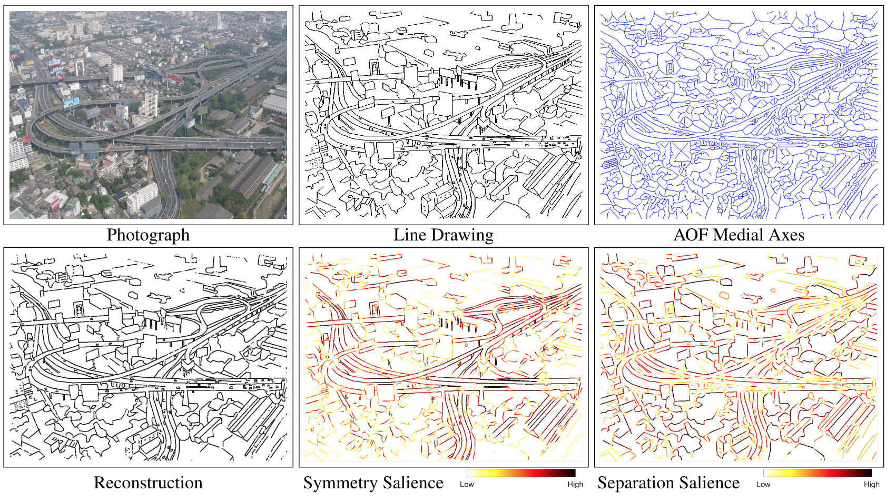

# Medial Axis Based Salience Measures for Scene Categorization


This repository presents our implementations to compute medial axis based salience measures for any binary image. 

Owing to the continuous mapping between the medial axis and scene contours, the medial axis provides a convenient representation for designing and computing Gestalt contour salience measures based on local contour separation and local symmetry. 
A measure to reflect local contour separation can be designed using the radius function along the medial axis, since this gives the distance to the two nearest scene contours on either side.

Local parallelism between scene contours, or ribbon symmetry, can also be directly captured by examining the degree to which the radius function along the medial axis between them remains locally constant. Finally, if taper is to be allowed between contours, as in the case of a set of railway tracks extending to the horizon under perspective projection, one can examine the degree to which the first derivative of the radius function is constant along a skeletal segment. Three novel measures to capture local separation, ribbon symmetry and taper, based on these ideas is introduced here.

To  gain  an  intuition  behind  these  perceptually  driven contour salience measures, we provide three illustrative examples in the left Figure below. The right Figure presents an illustrative example of a photograph from an artist scenes database, along with two of our me-dial  axis  based  contour  salience  maps.   Observe  how  theribbon symmetry based measure highlights the boundariesof  highways. 


<p align="center"></p>


## Setup

**NOTE** THIS CODE IS TESTED WITH MATLAB 2018b. Earlier version of MATLAB may not work with this package.

To download the code, open a terminal and type:
```
git clone https://github.com/mrezanejad/SalienceScoresForScene.git
```
This will create a directory `SalienceScoresForScene/` containing all of the code seen here.
<br>
## Usage


### Step 1 - Performance 
For faster performance, you may compile the `.m` matlab scripts included here to MEX binaries.

Open matlab and navigate to `SalienceScoresForScene/`. In the console, run:
```
>> compile_mex
```
This will create a folder `codegen/`, which contains auto-generate C code for the relevant `.m` files, which is then compiled to MEX.

<br>

### Step 2 - Run a demo
To compute the saliency scores of a single binary image, one can use our matlab function `compute_scence_salience`. Navigate to the downloaded `SalienceScoresForScene/` folder and from the matlab console run:
```
>> compute_scence_salience('path/to/your/image.png')
```

The skeletonScores and boundaryScores for `image.png` will be computed and saved to `image_skeletalScores.mat` and `image_boundaryScores.mat` files where each represent the scores on skeleton and boundary respectively. Any standard image format can be used.
<br>

**NOTE**: The algorithm only computes the skeleton for _white_ regions in the image.

The `compute_scence_salience.m` matlab script is the demo function of how one can use the implemented libraries and codes in this package. Please read the script carefully if you want to use or modify it for your use. 

**Tuning Parameters**: There are two tuning parameters in this code which you can tune for your own use. The first tuning parameter is `K` which is the window size where the salience measure is computed on. Formally in our paper this is the interval `[a,b]`. The second parameter is the `sigma` parameter which is the smoothing window for salience scores computed. 


**Salience computing method**:This is an option that you can set when using this code. `salience_computing_method` can accept one of the following inputs: `'maxR'` (`default value` - for separation), `'arc_length'` (for ribbon symmetry), `'derivative_arc_length'` (for taper symmetry). 

**Example**

We included a demo image just to give you an idea of how this works:
```
>> compute_scence_salience('demo.png')
```


## Updating
Assuming you have not made any local changes to these files, you can update your local code to the newest version with [git pull](https://git-scm.com/docs/git-pull).
Open a terminal, navigate to your `SalienceScoresForScene/` folder, and run
```
git pull
```

If you have edited any files, `git pull` may throw errors. You can update while keeping your local changes by running:
```
git stash
git pull
git stash pop
```

If you are new to git, you can learn more about it [here](https://git-scm.com/doc)
<br>
<br>

## References
If you use the our SalienceScoresForScenes package, we appreciate it if you cite the following papers:

```
@InProceedings{rezanejad2019scene,
author = {Rezanejad, Morteza and Downs, Gabriel and Wilder, John and Walther, Dirk B and Jepson, Allan and Dickinson, Sven and Siddiqi, Kaleem},
title = {Scene Categorization from Contours: Medial Axis Based Salience Measures},
booktitle = {The IEEE Conference on Computer Vision and Pattern Recognition (CVPR)},
month = {June},
year = {2019}
}

@article{WILDER2019307,
  title = "Local contour symmetry facilitates scene categorization",
  journal = "Cognition",
  volume = "182",
  pages = "307 - 317",
  year = "2019",
  issn = "0010-0277",
  doi = "https://doi.org/10.1016/j.cognition.2018.09.014",
  url = "http://www.sciencedirect.com/science/article/pii/S0010027718302506",
  author = "John Wilder and Morteza Rezanejad and Sven Dickinson and Kaleem Siddiqi and Allan Jepson and Dirk B. Walther",
  keywords = "Scene perception, Symmetry, Perceptual grouping, Scene categorization",
}
```

## Contact
For any question regarding this package, please contact morteza@cim.mcgill.ca

## License
This program is free software: you can redistribute it and/or modify
it under the terms of the GNU General Public License as published by
the Free Software Foundation, either version 3 of the License, or
(at your option) any later version.

This program is distributed in the hope that it will be useful,
but WITHOUT ANY WARRANTY; without even the implied warranty of
MERCHANTABILITY or FITNESS FOR A PARTICULAR PURPOSE.  See the
GNU General Public License for more details.

You should have received a copy of the GNU General Public License
along with this program.  If not, see <https://www.gnu.org/licenses/>.


